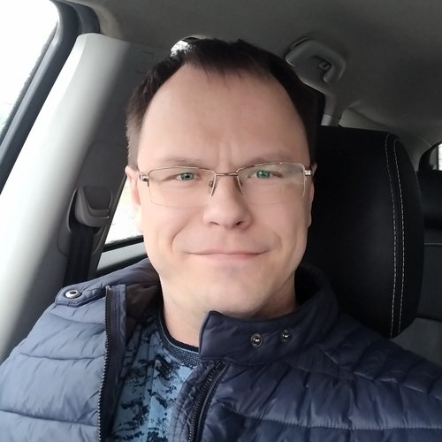

# **Andrey Kasyanenko** 

### **Contact information:**

**Location:** _Taganrog, Russia_  
 **Phone:** _+7 (928) 103 51 51_  
 **E-mail:** _kav.83@inbox.ru_  
 **GitHub:** [_Kasyanenko A.V._](https://github.com/KasyanenkoAV)

### **About Me**

I was born in 1983. \
During the period from 2001 to 2006, I studied at the Taganrog Radio Engineering University. After graduating from university, I received a specialization in Radio Communications Engineer.\
From 2006 to 2007, I retrained as an economist manager. My work experience began in 2006, during which time I worked in banking, insurance, real estate purchase and sale, and agriculture.\
In 2023, I retrained as an Information Technology Testing Specialist.\
[**Link to my full resume Kasyanenko A.V.**](https://taganrog.hh.ru/resume/beab3848ff006545cd0039ed1f736563726574)

### **Skills**

### **Code Example**

### **Experience**

### **Education**

| Year of study | Educational institution                                                         | Specialization    |
| :------------ | :------------------------------------------------------------------------------ | :---------------- |
| 2006          | Taganrog State University of Radioengineering                                   | Engineer          |
| 2007          | Intersectoral regional center for advanced training and retraining of personnel | Manager-economist |
| 2023          | LLC "Center for advanced training and professional training "Osnovanie"         | QA Engineer       |

### **Languages**

**Russian** - _native speaker_\
**English** - _B1_
